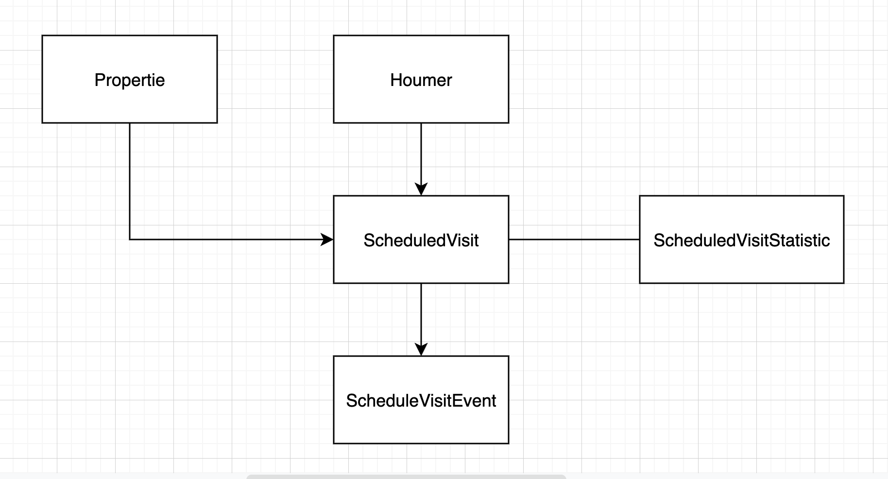
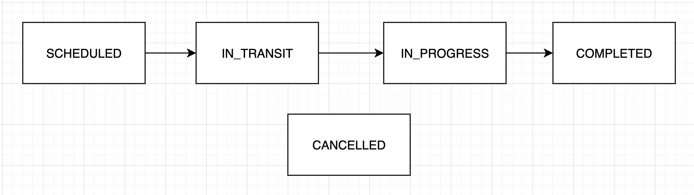

# PROBLEMA

En Houm tenemos un gran equipo de Houmers que muestran las propiedades y solucionan todos los problemas que podrían ocurrir en ellas. Ellos son parte fundamental de nuestra operación y de la experiencia que tienen nuestros clientes. Es por esta razón que queremos incorporar ciertas métricas para monitorear cómo operan, mejorar la calidad de servicio y para asegurar la seguridad de nuestros Houmers.

# REQUISITOS

Crear un servicio REST que:

* Permita que la aplicación móvil mande las coordenadas del Houmer
* Para un día retorne todas las coordenadas de las propiedades que visitó y cuanto tiempo se quedó en cada una
* Para un día retorne todos los momentos en que el houmer se trasladó con una velocidad superior a cierto parámetro

# SUPUESTOS
* Los Houmers pueden visitar una propiedad para hacer "x" actividades
* Los Houmers usaran un aplicativo para informar el estado de su actividad
* El aplicativo enviará las coordenadas de la posición actual.


# MODELADO PROPUESTO
- Propiertie: Los inmuebles que se quieren vender o rentar
- Houmer: El colaborador que muestran la propiedad o solucionan algún problema en ella.
- ScheduledVisit: La visita que el houmer tiene agendada para realizar "X" actividad en la propiedad
- ScheduledVisitEvent: Guardará la información de cada cambio de estado, como la localización
- ScheduledVisitStatistic: Guardará la información necesaria para los reportes. como la velocidad y el tiempo en cada propiedad.




# FLUJO PROPUESTO
- SCHEDULED: Estado inicial, todos las ScheduledVisit iniciarán con este estado
- IN_TRANSIT: Cuando el houmer este en camino a la propiedad, debe usar este estado.
- IN_PROGRESS: Cuando el houmer este en la propiedad realizando la actividad programada, marcará este estado.
- COMPLETED: Cuando se termine la actividad debe cambiar a este estado.



# REQUISITOS PARA LEVANTAR EL PROYECTO
- docker y docker-compose
- make (opcional)
# CORRER EL PROYECTO EN LOCAL
```
make docker-local-run
```
o si no tienes make instalado
```
docker-compose -f  ./server-config/local/docker-compose.yml up
```
# LOAD DATA
Puedes cargar data de prueba con el siguiente comando
```
docker-local-loaddata
```
o si no tienes make instalado
```
docker-compose -f ./server-config/local/docker-compose.yml exec back python ./src/manage.py loaddata dbv2.json --settings=config.settings.local
```
# TESTS
```
docker-local-run-tests
```
o si no tienes make instalado
```
docker-compose -f ./server-config/local/docker-compose.yml run back pytest /www/src/tests
```

# DOCUMENTACIÓN

Se puede revisar la documentación de las APIs en el siguiente link: http://localhost:8000/swagger/
para hacer las pruebas necesitará estar logueado como un houmer.
puede usar estas credenciales
```
user: houmer1
pass: houmer1
```

# TROUBLESHOOTING
Si usas un procesador arm, quizás tengas problemas con la imagen de postgis, en el docker-compose de local tienes que descomentar un par de lineas.